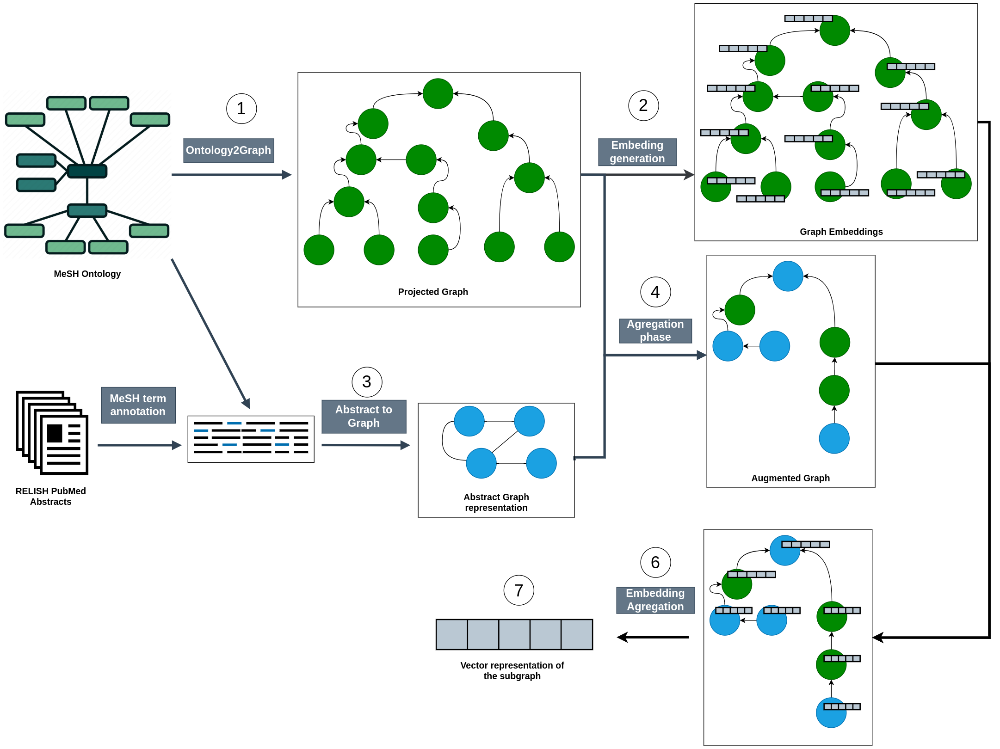

## General flow

The application is divided in steps to transform the data, each step can be observed in the next diagram.



Each step has a folder inside the Code folder. Inside of each folder multiple implementations of the transformation can be found, each implementation has a version to represent improvements that have been done.

The 5th step is not found in the diagram because this step is part of another approach. 
The 8th step is not found in the diagram because its an analysis to improve upon a future approach.

## Instructions to run the algorithms.


To execute this algorithms for the first time you need to create a conda environment. Conda is a powerful package manager and environment manager.

Install [conda](https://conda.io/projects/conda/en/latest/user-guide/install/index.html). 


Enter the Code folder in the terminal window.
Then execute the following command on the terminal.

```
conda env create -f environment.yml
```

In the environment.yml file we specify all the necessary libraries or software that is required to run the project.

After the enviroment is created every time you want to work on the project you need to activate it.

```
conda activate graph2doc2vec_env
```

In case updates have been preformed on the environment.yml file you need to update the dependencies with.

```
conda env update graph2doc2vec_env --file environment.yml --prune
```

Remember to download the RELISH_documents_20220628_ann.tsv dataset and ubicated in the /Data/Input folder.

